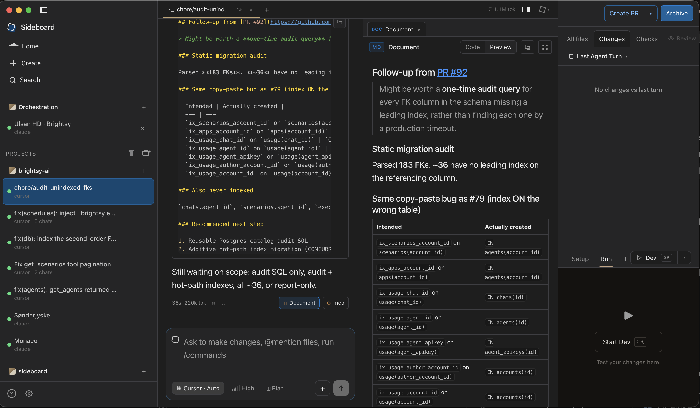

# Sideboard

**Local orchestration for a fleet of coding agents.** On your Mac, on the network you already sit on.

One agent per git worktree is a crowded pattern in 2026 — Conductor, Cursor’s Agents window, Claude Code, and OSS boards (Superset, Emdash, Claude Squad) all spawn that. The remaining job is an **orchestration tier**: an agent that can reason about other threads, a board where you can see that, and Slack so a coworker can enter the loop — without moving the repo into someone else’s cloud.

Sideboard is CLI + MCP + a Mac desktop for that tier. Agents are plugs (Claude Code, Codex, OpenCode, Cursor). Compute stays on this machine (corporate VPN, private git, internal APIs). Slack is remote control, not a rented sandbox.

1. **A global board for you** — status, live output, and fan-out across every thread
2. **An MCP for the agents** — list threads, wait on turns, read diffs, orchestrate the fleet, and present artifacts, schemas, and files in the desktop UI
3. **Slack to this Mac** — DM/@mention the orchestrator; it can ping a coworker to review a PR a worktree just pushed; their reply comes back as information

`attach` / `adopt` remain the door back to the native harness — move in and out of Sideboard as you choose.

Run agents in isolated `thread/*` worktrees from the CLI, desktop, or MCP. The Mac must stay awake for Slack to reach them.



**Agents and backends are plugs, not the product.** CLI, MCP, and the desktop board work with Claude Code, Codex, OpenCode, and Cursor alone. Schema UI is **JSON Schema → table/form**, not a CMS shell. The agent can invent a schema for whatever data it needs; wire inline JSON or another datasource later. CLI and MCP also run without the desktop app. Slack is built in ([setup](#slack)).

## Who it's for

Fits if you already run several local CLI agents on a Mac — especially one on a corporate VPN — and want an orchestrator you can see, an agent can drive, and Slack can reach. Extra fit when the agent produces structured content or HTML that should sit next to the diff.

Use something else if you want a polished local board and will not use CLI/MCP ([Conductor](https://www.conductor.build/) free), their paid cloud workspaces (agents that keep running after you close the laptop, off-VPN), an IDE-native Agents window (Cursor 3), Windows/Linux desktop ([Emdash](https://emdash.sh/), [Superset](https://github.com/superset-sh/superset)), or cloud agents that do not run on this machine.

Peer-by-peer notes: [Compare](docs/COMPARE.md).

## Why it exists

Spawning worktrees is the shared primitive. Boards that stay human-only tend to put fleet orchestration in a **paid cloud**. Sideboard puts that tier on the Mac you already use, on the VPN it is already on:

| Job | Typical tools | Sideboard |
|-----|---------------|-----------|
| Run N agents in isolated worktrees | Yes | Yes |
| Orchestrate the fleet (agent-visible) | Human board, or a cloud API | MCP + Global board, on this Mac |
| Stay on the corporate VPN | Cloud sandboxes leave it | Agents run as you, on this laptop’s network |
| Coworker in the loop | Product cloud / shared sandbox | Slack: review ping; reply comes back as info |
| Keep going when you step away | Cloud sandbox keeps running | Slack to this Mac — the machine must stay awake |
| See the whole fleet as one board | App-locked or thin | First-class global board |
| Drop into the native CLI mid-session | Weak or one-way | `attach` keeps the same session |
| Recurring process guides | Locked in the product, or chat memory | Committed `.claude/skills` — Claude Code and `attach` load them |
| Bring existing worktrees / Conductor workspaces in | Stuck or start over | `adopt` + Conductor import |
| Review HTML / docs the agent built | Copy out, or locked chat UI | `present_artifact` → side column |
| Collect / edit structured data the agent needs | Spreadsheet, separate CMS, or markdown forever | `present_schema` → form/table from a schema the agent can create |
| Files for that data + the git worktree | Two other windows | File manager tabs + far-right repo Files / Changes / CI |

Agents write code **and** invent data shapes (content, configs, feedback, ops rows). Sideboard is where those meet — **code in the worktree, data in schema UI** — without a CMS product.

A concrete loop: pull or edit page content and media in schema + files tabs, then have the agent write it into a **static site** in the same worktree (Astro, Next export, Eleventy, plain HTML) — review the data and the generated pages before you land.

Mechanical control (list, send, diff, land) stays on the CLI — zero tokens. Use MCP when an agent needs *judgment* across threads or needs to open a pane. CLI `land` and `purge` stay human-only. Orchestrators may tell a worktree agent to merge (`ask_git`) only when the user explicitly asked.

Also true, and useful on the way:

- **Agent-agnostic** — Claude Code, Codex, OpenCode, Cursor (via `@cursor/sdk`, Conductor-style)
- **Schema-agnostic / CMS-optional** — render any JSON Schema + `schemaUi`. CMS is a use case, not the category
- **Surface-agnostic** — CLI (`sideboard` / `side`), Electron desktop, MCP, or native interactive via `attach`
- **Origin-agnostic** — create from branch/PR/ticket, adopt any worktree, import Conductor workspaces with chat history
- **Local-first / Slack-remote** — agents stay on this Mac (VPN, private git, internal APIs); Slack is how you and a coworker reach them ([setup](#slack))
- **Portable process skills** — recurring guides are Claude Code project skills (`.claude/skills/<name>/SKILL.md`). Sideboard `/name`, Claude Code, and `attach` all load that path ([Process skills](#process-skills))

Docs: [Contributing](CONTRIBUTING.md) · [Agent adapters](docs/agent-adapters.md) · [Slack](#slack) · [Remote integrations](docs/remote-integrations.md) · [Compare](docs/COMPARE.md) · [Process skills](#process-skills) · [Security](SECURITY.md)

Marketing site: [www.sideboard.cloud](https://www.sideboard.cloud) · [docs](https://www.sideboard.cloud/docs/) (same Fly app as the Slack relay; `relay.sideboard.cloud` stays Slack-only)

## Install

### CLI (npm)

```bash
npm i -g @sideboard-ai/cli
sideboard detect
```

### Desktop

Download the latest **Apple Silicon** Mac build from [GitHub Releases](https://github.com/mattlevine/sideboard/releases/latest):

https://github.com/mattlevine/sideboard/releases/download/v0.1.100/Sideboard-0.1.100-arm64.dmg

> Direct download links only work while the GitHub repo (or its releases) are **public**.

The app auto-updates via `electron-updater` (checks on launch and every 4 hours; shows an in-app + OS notification when a new version is available, then **Restart to update** when the download finishes — never restarts mid-session silently).

#### Releasing

```bash
# One-time: copy Brightsy (or your) Developer ID + npm token into apps/desktop/.env
cp apps/desktop/.env.example apps/desktop/.env

# From repo root — bump versions, publish npm + Mac desktop, tag
pnpm release                 # patch → @sideboard-ai/cli + @sideboard-ai/core + desktop
pnpm release minor
pnpm release patch npm       # CLI + MCP only (core ships `sideboard-mcp`)
pnpm release patch mac       # desktop GitHub Release only
pnpm release patch all never # dry-run / local artifacts
```

After `npm i -g @sideboard-ai/cli`, MCP is `sideboard mcp` (or `npx sideboard-mcp`).

### Agent CLIs

Sideboard shells out to each agent’s CLI. Install the ones you want on your `PATH`, then authenticate. `sideboard detect` reports what’s available.

#### Claude Code

```bash
npm install -g @anthropic-ai/claude-code
claude          # complete login on first run
```

Docs: [code.claude.com/docs/en/install](https://code.claude.com/docs/en/install)

#### Codex

```bash
npm install -g @openai/codex
codex           # complete login / auth on first run
```

Docs: [github.com/openai/codex](https://github.com/openai/codex)

#### OpenCode

```bash
# Recommended (macOS / Linux)
curl -fsSL https://opencode.ai/install | bash

# Or via npm (package name is opencode-ai, not opencode)
npm install -g opencode-ai@latest
opencode auth login
```

Docs: [opencode.ai/docs](https://opencode.ai/docs)

#### Cursor

Local Cursor agents via the official SDK (same approach Conductor uses — not a CLI spawn).

Set the key in the desktop app under **Settings → Agents → Cursor** (also appears under **Settings → Environment** as `CURSOR_API_KEY`), or in your shell:

```bash
export CURSOR_API_KEY="cursor_..."   # https://cursor.com/dashboard/integrations
sideboard detect                     # cursor should show authenticated
```

Shell env wins if both are set. Docs: [cursor.com/docs/sdk/typescript](https://cursor.com/docs/sdk/typescript)

Verify everything Sideboard can see:

```bash
sideboard detect
```

## Quick start

The loop that matches why Sideboard exists: board → send → inspect → attach when you want the native CLI → land when ready.

```bash
sideboard detect
sideboard new --from branch:main --agent claude
sideboard ls
sideboard send <thread> "add a README note"
sideboard diff <thread>
sideboard attach <thread>        # drop into the native CLI, same session
sideboard land <thread>          # interactive y/N; no --yes in v1
sideboard adopt --from-conductor # import Conductor workspaces + history
```

Aliases: `side` → `sideboard`.

For the global board, live orchestration, and the code + data desktop layout, run the app.

## Desktop — union of agent code and data

A worktree chat is **repo + worktree + CMS** in one view:

| Zone | Layer | What it is |
|------|-------|------------|
| **Far right** | Repo | Connected git worktree — Files / Changes / CI / Review, Setup / Run / Terminal |
| **Chat** | Worktree agent | The thread driving that worktree |
| **Structure column** (tabs) | CMS / data | Artifacts, schema → form/table, file manager — content and files the agent needs you to see or edit |

Agents open structure tabs via MCP (or you reopen them from message chips). Tabs stick per chat until you close them.

### Schema → form (not “a CMS product”)

`present_schema` takes **JSON Schema + optional `schemaUi`** and renders a filterable table and/or form. The agent can **create the schema** for whatever it needs — articles, feedback, config, checklists, research rows — then hand you a UI to fill or correct it. That might back a CMS, feed a **static website** build in the worktree, or be a one-off shape for the turn.

Same chrome for every backend:

- Typed fields from the schema; TipTap rich text + markdown via `schemaUi`
- Relationships (has-one / has-many) with in-pane navigation
- Draft / publish only when the resource declares content states — otherwise save-only
- Media fields jump to a Files tab in **select mode**, then return to the form

| Provider | When |
|----------|------|
| `inline` | Agent embeds `resource` / `records` in the tool call — any use, no extra account |
| `brightsy` | Optional — logged-in Brightsy team + `resource_id` |

### Artifacts & file manager

- **`present_artifact`** — HTML / SVG / markdown in the same column (Claude-style docs, yours)
- **`present_files`** — browse / upload / pick (`memory` demo, or optional Brightsy storage). Drag from Finder or from Sideboard’s worktree file list. Multiple Files tabs can sit beside multiple schema tabs.

New datasources implement list/get/save (and optional publish). They do not fork the column UI.

## MCP — agents that can see the fleet

Install the CLI (ships the stdio server), then register it with your MCP client:

```bash
npm i -g @sideboard-ai/cli
sideboard mcp          # same as: npx sideboard-mcp
```

Sideboard desktop **auto-injects** this MCP into Claude / Cursor / Codex / OpenCode turns (orchestration and worktree). The packaged Mac app also merges a `sideboard` entry into `~/.cursor/mcp.json` (and `~/.claude.json` if it already exists) so Cursor IDE / Claude Code see the same fleet and store as Sideboard.app (`SIDEBOARD_APP_DATA` → `~/Library/Application Support/sideboard`). Use the steps below when you want to register MCP yourself — Claude Code in a project, Cursor IDE Agent, Codex CLI, etc.

Pin `SIDEBOARD_APP_DATA` if a `sideboard` binary on PATH should still hit this Mac’s Sideboard store.

### Connect Claude Code

```bash
# All projects (user scope)
claude mcp add --scope user sideboard -- sideboard mcp

# Or one project only (omit --scope, or use --scope project)
claude mcp add sideboard -- sideboard mcp
```

Confirm with `/mcp` inside a Claude session, or `claude mcp list`.

### Connect Cursor

Add a project or global MCP entry (Cursor → Settings → MCP, or `.cursor/mcp.json`):

```json
{
  "mcpServers": {
    "sideboard": {
      "command": "sideboard",
      "args": ["mcp"],
      "env": {
        "SIDEBOARD_APP_DATA": "/Users/you/Library/Application Support/sideboard"
      }
    }
  }
}
```

Prefer `npx -y sideboard-mcp` for `command` / `args` if `sideboard` is not on Cursor’s PATH. Packaged Sideboard.app writes the absolute `node` + extraResources path here on launch (merge, does not clobber other servers).

### Connect Codex

Add to `~/.codex/config.toml` (or pass equivalent `-c` overrides):

```toml
[mcp_servers.sideboard]
command = "sideboard"
args = ["mcp"]

[mcp_servers.sideboard.env]
SIDEBOARD_APP_DATA = "/Users/you/Library/Application Support/sideboard"
```

Sideboard does not rewrite `~/.codex/config.toml`; add the block above (or equivalent `-c` overrides) so Codex CLI shares the packaged store.

### Connect OpenCode

Add to `~/.config/opencode/opencode.jsonc` (or a project `opencode.jsonc`) under `mcp`, or merge via `OPENCODE_CONFIG_CONTENT`:

```json
{
  "mcp": {
    "sideboard": {
      "type": "local",
      "command": ["sideboard", "mcp"],
      "enabled": true
    }
  }
}
```

### What agents get

Once connected, agents get tools to:

- **Discover** — `list_workspaces` (path + GitHub slug), `list_branches` / `list_prs` / `list_issues` (Linear or GitHub), `list_threads`
- **Linear tickets** — `linear_list_teams`, `linear_get_issue`, `linear_create_issue`, `linear_update_issue`, `linear_comment` (Account OAuth; reconnect if you connected before write access)
- **Workspaces** — `add_workspace` / `remove_workspace`
- **Worktree chats** — `create_thread` → `send_to_thread` → `wait_for_turn` / `get_turn_result` (from a Sideboard orchestration chat, omit `parentThreadId` — MCP binds the child to that chat; do not invent uuids); `fork_worktree` / `fork_chat` (optional agent; Auto model unless pinned via `list_models`; `fork_chat` also forks Global orchestration chats); `stop_thread` force-stops (kills in-flight turn and clears the prompt queue); `send_to_thread` accepts optional `force_stop` to interrupt+replace; `archive_thread`, `restore_thread`
- **Present structure (desktop)** — `present_artifact` (HTML/SVG/MD), `present_schema` (JSON Schema → table/form; agent can invent the schema), `present_files` (file manager); tabs beside chat, git repo stays on the far right
- **Ask the user** — `ask_user` (composer multiple-choice when work is blocked on a concrete choice — not greetings or “what next?” menus). Agents explain options in chat first; Sideboard shows the picker and mirrors questions in the transcript.
- **Setup / run** — `run_setup` (also runs automatically on new worktrees), `list_run_scripts`, `run_dev_script`, `stop_dev_script`
- **Inspect / review / PRs** — `get_diff`; `request_review` (opens a Review chat tab on a worktree thread); `ask_git` (commit & push, draft PR, resolve conflicts, merge — same prompts as the desktop git buttons). Merge only when the user explicitly asked.

Ready-for-review land (`confirm_land`) and `purge_thread` stay human-only. Coordinators commit, push, and open PRs by asking the worktree agent. They merge only when the user explicitly asked.

## Linear

**Settings → Account → Linear → Connect via browser.** Sideboard stores the OAuth token on this Mac and uses it for Create-from / Link issue and MCP ticket tools (`linear_create_issue`, `linear_update_issue`, `linear_comment`). A personal API key still works if you paste one.

OAuth requests `read,write`. Linear’s OAuth app page has no scopes checklist — Sideboard sets them in `LINEAR_OAUTH_SCOPES`. If you connected when Sideboard was read-only, **Disconnect and Connect via browser** so Linear re-consents.

Desktop Connect uses Chromium networking so corporate VPNs/proxies that break Node `fetch` (`Error invoking remote method 'startLinearOAuth': fetch failed`) still reach `api.linear.app`. CLI `sideboard linear login` still uses Node fetch — set `HTTPS_PROXY` or connect off-VPN.

```bash
sideboard linear login
sideboard linear disconnect
```

Callback URL for the Sideboard Linear OAuth app: `http://127.0.0.1:19848/callback`. Override the client with `SIDEBOARD_LINEAR_CLIENT_ID` (secret optional — the desktop uses PKCE). You will not see that baked app under *your* Linear **API → OAuth applications** — it lives on Sideboard’s Linear workspace. Authorized copies show under workspace **Settings → Applications** after you connect.

## Slack

Slack is the remote surface for the **same local orchestrator** — not a cloud workspace. DMs and `@mentions` go to the Global orchestrator on this Mac; it can `slack_post` a coworker to review a PR a worktree just pushed; their reply is copied back into your orchestration chat as information (not a command). Replies from the orchestrator post back to Slack.

Each MacBook is its own destination (Personal, Work, …).

```
┌────────────────┐     hosted relay      ┌──────────────────┐
│ Slack          │ ─────────────────────► │ Sideboard Mac    │
│ DM / @mention  │     (WSS)              │ (Personal/Work)  │
└────────────────┘ ◄── chat.postMessage ──└────────┬─────────┘
                                                   │
                                                   ▼
                                          Global orchestrator → worktrees
```

**What stays on this Mac.** Agents, worktrees, repos, and secrets — including anything only reachable on the corporate VPN. **What leaves:** Slack message text, via `relay.sideboard.cloud`. The relay does not host worktrees.

Keep the desktop app running after you connect a workspace. Slack cannot reach the fleet if this machine is asleep; turn on caffeinate from the orchestration chat when you need it to stay awake, and turn it off when you are done.

### Connect

**Settings → Account → Slack workspaces**

1. **Add via browser** — installs the official Sideboard Slack app into a workspace (use this; paste-only bot tokens cannot prove which Slack user owns the Mac). Until **Manage Distribution → Activate Public Distribution** is on, Slack sends that flow to the app’s home workspace (`brightsy.slack.com`) and will not list other teams. Slack requires an HTTPS redirect; Sideboard uses `https://relay.sideboard.cloud/slack/callback`. The relay exchanges the OAuth code (the client secret stays on the server). Sideboard polls until that finishes.
2. **This Mac** — name the destination (`Personal`, `Work`, …). Each Mac gets a stable id; both can stay online at once.
3. Listening starts when a workspace is connected. Status should show `Relay connected · Personal` (or your name).

Use **Cancel** in Settings if you close the Slack tab — closing the browser does not stop the wait.

Someone else messaging the bot needs **their** Sideboard online — messages route to the Slack user who connected that Mac, not to tabs on yours.

Env overrides (optional): `SIDEBOARD_SLACK_RELAY_URL` (e.g. local `ws://127.0.0.1:8787/slack/desktop`), `SIDEBOARD_SLACK_OAUTH_REDIRECT` (defaults to `https://relay.sideboard.cloud/slack/callback`).

### Talk to a Mac from Slack

| Where | What to type |
|-------|----------------|
| **DM the bot** | `work: Check the failing CI` |
| **Channel / thread** | `@sideboard work: Check the failing CI` |

The destination prefix is the **This Mac** name (case does not matter). Mentions are stripped before routing, so `work:` is what selects the Mac.

- One Mac online → it handles unprefixed messages.
- Personal and Work both online → unprefixed messages go to whichever claims first. Replies are signed (`Work: …`) so you can see who answered, then address that Mac with `work:` / `personal:`.
- A follow-up message interrupts the in-progress turn and starts a new one. Send `stop` to cancel without a replacement prompt.
- Closing the Slack coordinator chat (or every Global tab) does not disable Listen. The next DM/@mention opens a new Global chat.

### CLI

```bash
sideboard slack teams
sideboard slack login          # browser OAuth
sideboard slack listen         # same listen path as the desktop
```

Agents can also call MCP `list_teams` / `slack_list_channels` / `slack_list_users` / `slack_search` / `slack_read` / `slack_post` / `slack_replies` once a workspace is connected (optional `github_url` for a PR or permalink).

If someone replies in Slack to a message Sideboard posted, that reply is copied into the orchestration chat as information (not a command — it does not start a turn). A per-user badge also appears next to the Sideboard wordmark; click it to open that thread in Slack. If you were talking to the orchestrator from Slack, Sideboard FYIs you there too.

More detail: [docs/remote-integrations.md](docs/remote-integrations.md).

## Also: Brightsy

Optional hosted chat and one schema/files backend. Skip this if you use Claude, Codex, OpenCode, or Cursor. Remote control of this Mac is **Slack**, not Brightsy.

```bash
npm install -g @brightsy/cli
brightsy login
```

Then Settings → Agents → Brightsy to connect a team. That unlocks hosted chat in the agent picker (no local file edits) and `datasource=brightsy` for `present_schema` / `present_files`. Inline schema and memory files work with no Brightsy account.

`sideboard brightsy teams` / `connect-team` wrap the same team list. Worktree agents get Brightsy MCP only when you ask, or when Settings → Advanced → Inject Brightsy MCP is on.

## Monorepo

```
packages/core     # orchestrator, agents, git, MCP, store
packages/cli      # commander CLI (bins: sideboard, side)
apps/desktop      # Electron (electron-vite + React) — global board UI
```

```bash
pnpm install
pnpm --filter @sideboard-ai/core build
pnpm --filter @sideboard-ai/cli build
pnpm --filter @sideboard-ai/desktop dev
```

## Worktrees & repo config

Worktrees live **outside** the repo (Conductor-style):

```
~/sideboard/workspaces/<repo-slug>/<soccer-team>/
```

New threads pick an unused famous soccer team (e.g. `liverpool`, `ajax`) for the worktree directory and a placeholder `thread/<team>` branch — same idea as Conductor’s city nicknames. On the first agent turn, Sideboard asks the agent to rename the branch to match the task; the sidebar then shows the PR title (if any) or that branch name.

Override per repo in `.sideboard/settings.toml`:

```toml
[worktrees]
# root = "~/sideboard/workspaces/my-repo"

[scripts]
setup = "pnpm install"

[scripts.run.dev]
command = "PORT=${SIDEBOARD_PORT:-${CONDUCTOR_PORT:-3000}} pnpm --filter web dev"
default = true
```

Sideboard prefers `.sideboard/settings.toml` and falls back to `.conductor/settings.toml` when present (so existing Conductor-configured repos keep working). Dev scripts get both `SIDEBOARD_PORT` and `CONDUCTOR_PORT`.

New worktrees run setup automatically (create / fork / stack layer) in the background — it does not block the chat. If `[scripts] setup` is missing, Sideboard uses `.cursor/worktrees.json` `setup-worktree`, then a conventional `script/setup`, `bin/setup`, or `scripts/setup(.sh)` when one of those files exists.

### Review guidelines

Commit `.sideboard/review.md` to customize merge-readiness Review for the whole repo. The Review button attaches that file when present; otherwise it uses a local `.context/attachments/Review request.md` (gitignored) or seeds the stock template there. **Customize guidelines…** creates/opens `.sideboard/review.md` so you can check it in. Workspace-local chat scratch (plans, drops, review seeds) lives under `.context/attachments/` — same idea as Conductor’s `.context` vs committed `.sideboard/` / `.conductor/` config.

### Process skills

When the same shape of work will happen again, write a Claude Code project skill at `.claude/skills/<name>/SKILL.md` and commit it. Sideboard’s composer `/name` expander, Claude Code, and `attach` all load that path — so the guide works outside Sideboard. Do not put new skills in `.sideboard/skills` (Sideboard still scans it; other agents do not). Point Codex/OpenCode at the file from `AGENTS.md`. Optional: symlink `.cursor/skills/<name>` to the Claude skill.

- **One-offs** should not create a skill. The first run is still a loop; corrections become sentences in the guide.
- **Same miss twice** → edit the skill (or `.sideboard/review.md`) and rerun. Do not patch three threads and leave the process unchanged.
- After merge to the default branch, **new worktrees inherit** the file. Existing siblings need an update from that branch.

This repo’s method skill is [`.claude/skills/graph-engineering/SKILL.md`](.claude/skills/graph-engineering/SKILL.md) (`/graph-engineering`): judge first, state on disk, grow the rulebook, blind review, fix the process not the instances. A Cursor symlink lives at `.cursor/skills/graph-engineering`. Type `/graph-engineering` in the Sideboard composer to attach it.

Older threads that already point at a repo-local path keep working; new threads always use the home-dir (or configured) root.

## Safety (v1)

- Landing on the default branch is blocked
- Dirty worktrees require an explicit land confirm (auto-commit then push/PR)
- Fork PRs are not landed in v1
- No `--yes` on `land`

## License

Apache-2.0 — see [LICENSE](LICENSE). Contributions welcome under [CONTRIBUTING.md](CONTRIBUTING.md).
