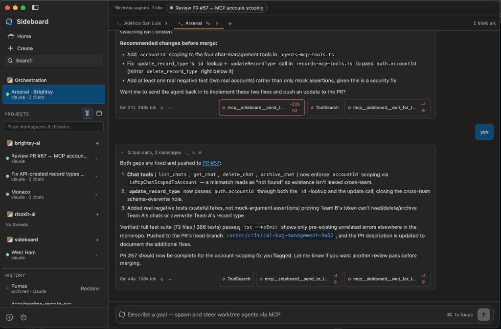

# Sideboard

**Your agent threads aren't trapped anywhere.**

When you run many AI coding agents at once, the hard part isn't spawning worktrees — it's knowing what's going on, and not getting stuck inside someone else's UI.

Sideboard is an open control plane over git worktrees:

1. **A global board for you** — see status, live output, and fan-out across every thread in one place
2. **An MCP for the agents** — Claude Code and Codex can list threads, wait on turns, read diffs, and orchestrate work instead of treating the fleet as a black box
3. **A door back to the native harness** — `attach` into Claude/Codex/OpenCode mid-flight, or `adopt` sessions that started elsewhere

Run agents in isolated `thread/*` worktrees from the CLI, desktop app, or MCP — then move in and out of Sideboard as you choose.



**Brightsy is optional.** Core CLI, MCP, and desktop board work with Claude Code, Codex, OpenCode, and Cursor alone. CLI and MCP also run separately from the desktop app — you can build your own Slack/Discord bridges on them ([docs/remote-integrations.md](docs/remote-integrations.md)).

## Why it exists

Most multi-agent tools optimize for parallelism. Sideboard optimizes for **visibility and handoff**:

| Job | Typical tools | Sideboard |
|-----|---------------|-----------|
| Run N agents in isolated worktrees | Yes | Yes |
| See the whole fleet as one board | App-locked or thin | First-class global board |
| Let an agent *reason about* other threads | Opaque / none | MCP: list, send, wait, diff |
| Drop into the native CLI mid-session | Weak or one-way | `attach` keeps the same session |
| Bring existing worktrees / Conductor workspaces in | Stuck or start over | `adopt` + Conductor import |

Mechanical control (list, send, diff, land) stays on the CLI — zero tokens. Use MCP when an agent needs *judgment* across threads. Land and purge stay human-only.

Also true, and useful on the way:

- **Agent-agnostic** — Claude Code, Codex, OpenCode, Cursor (via `@cursor/sdk`, Conductor-style); optionally Brightsy (hosted chat via `brightsy chat --json`; no local file edits)
- **Surface-agnostic** — CLI (`sideboard` / `side`), Electron desktop, MCP, or native interactive via `attach`
- **Origin-agnostic** — create from branch/PR/ticket, adopt any worktree, import Conductor workspaces with chat history
- **Integration-friendly** — remote chat (Slack, etc.) can sit on CLI/MCP without Brightsy; see [docs/remote-integrations.md](docs/remote-integrations.md)

Docs: [Contributing](CONTRIBUTING.md) · [Agent adapters](docs/agent-adapters.md) · [Remote integrations](docs/remote-integrations.md) · [Compare](docs/COMPARE.md) · [Security](SECURITY.md)

## Install

### CLI (npm)

```bash
npm i -g @sideboard-ai/cli
sideboard detect
```

### Desktop

Download the latest Mac build from [GitHub Releases](https://github.com/mattlevine/sideboard/releases/latest):

| Chip | DMG |
|------|-----|
| Apple Silicon | https://github.com/mattlevine/sideboard/releases/download/v0.1.19/Sideboard-0.1.19-arm64.dmg |
| Intel | https://github.com/mattlevine/sideboard/releases/download/v0.1.19/Sideboard-0.1.19.dmg |

> Direct download links only work while the GitHub repo (or its releases) are **public**. The repo is currently private — make it public (or host the DMGs elsewhere) before sharing the README links.

The app auto-updates via `electron-updater` (checks on launch and every 4 hours; shows an in-app + OS notification when a new version is available, then **Restart to update** when the download finishes — never restarts mid-session silently).

#### Releasing

```bash
# One-time: copy Brightsy (or your) Developer ID + npm token into apps/desktop/.env
cp apps/desktop/.env.example apps/desktop/.env

# From repo root — bump versions, publish npm + Mac desktop, tag
pnpm release                 # patch → @sideboard-ai/cli + @sideboard-ai/core + desktop
pnpm release minor
pnpm release patch npm       # CLI + MCP only (core ships `sideboard-mcp`)
pnpm release patch mac       # desktop GitHub Release only
pnpm release patch all never # dry-run / local artifacts
```

After `npm i -g @sideboard-ai/cli`, MCP is `sideboard mcp` (or `npx sideboard-mcp`).

### Agent CLIs

Sideboard shells out to each agent’s CLI. Install the ones you want on your `PATH`, then authenticate. `sideboard detect` reports what’s available.

#### Claude Code

```bash
npm install -g @anthropic-ai/claude-code
claude          # complete login on first run
```

Docs: [code.claude.com/docs/en/install](https://code.claude.com/docs/en/install)

#### Codex

```bash
npm install -g @openai/codex
codex           # complete login / auth on first run
```

Docs: [github.com/openai/codex](https://github.com/openai/codex)

#### OpenCode

```bash
# Recommended (macOS / Linux)
curl -fsSL https://opencode.ai/install | bash

# Or via npm (package name is opencode-ai, not opencode)
npm install -g opencode-ai@latest
opencode auth login
```

Docs: [opencode.ai/docs](https://opencode.ai/docs)

#### Cursor

Local Cursor agents via the official SDK (same approach Conductor uses — not a CLI spawn).

Set the key in the desktop app under **Settings → Agents → Cursor** (also appears under **Settings → Environment** as `CURSOR_API_KEY`), or in your shell:

```bash
export CURSOR_API_KEY="cursor_..."   # https://cursor.com/dashboard/integrations
sideboard detect                     # cursor should show authenticated
```

Shell env wins if both are set. Docs: [cursor.com/docs/sdk/typescript](https://cursor.com/docs/sdk/typescript)

#### Brightsy (optional)

Hosted agents and models via `brightsy chat --json` (chat-only — no local file edits). Not required for Sideboard.

```bash
npm install -g @brightsy/cli
brightsy login
brightsy whoami
```

Docs: [@brightsy/cli](https://www.npmjs.com/package/@brightsy/cli)

Verify everything Sideboard can see:

```bash
sideboard detect
```

## Quick start

The loop that matches why Sideboard exists: board → send → inspect → attach when you want the native CLI → land when ready.

```bash
sideboard detect
sideboard new --from branch:main --agent claude
sideboard ls
sideboard send <thread> "add a README note"
sideboard diff <thread>
sideboard attach <thread>        # drop into the native CLI, same session
sideboard land <thread>          # interactive y/N; no --yes in v1
sideboard adopt --from-conductor # import Conductor workspaces + history
```

Aliases: `side` → `sideboard`.

For the global board and live orchestration UI, run the desktop app.

## MCP — agents that can see the fleet

```bash
sideboard mcp
```

Point Claude Code, Codex, or any MCP client at that server. Agents get tools to:

- **Discover** — `list_workspaces` (path + GitHub slug), `list_branches` / `list_prs` / `list_issues` (Linear or GitHub), `list_threads`
- **Workspaces** — `add_workspace` / `remove_workspace`
- **Worktree chats** — `create_thread` → `send_to_thread` → `wait_for_turn` / `get_turn_result`; `stop_thread` force-stops (kills in-flight turn and clears the prompt queue); `send_to_thread` accepts optional `force_stop` to interrupt+replace; `archive_thread`, `restore_thread`
- **Setup / run** — `run_setup`, `list_run_scripts`, `run_dev_script`, `stop_dev_script`
- **Inspect / PRs** — `get_diff`; ask worktree agents via `send_to_thread` to `gh pr create --draft` (no host draft-PR tool)

Ready-for-review land / merge and `purge_thread` stay human-only. The cloud coordinator cannot be archived via MCP. Coordinators open PRs only by asking the worktree agent.

Want Slack (or any chat) without Brightsy? Point your bot at this MCP or the CLI — [docs/remote-integrations.md](docs/remote-integrations.md).

## Optional: Brightsy

Brightsy integrations below are **optional**. Skip this entire section if you only use Claude/Codex/OpenCode/Cursor.

### Brightsy MCP on every Claude thread

When `brightsy login` is active, Sideboard auto-injects Brightsy MCP (`brightsy-mcp` or `npx @brightsy/mcp-server`) into **all Claude thread turns** via `--mcp-config` — no separate Claude MCP registration required. Coordinator threads also get Sideboard MCP.

Install the MCP binary if you want the faster path (otherwise `npx` is used):

```bash
npm i -g @brightsy/mcp-server
```

### Connect Brightsy teams (CLI + MCP)

Team list/switch is provided by Brightsy itself:

```bash
brightsy teams                 # list
brightsy teams switch <slug>   # activate (updates ~/.brightsy)
```

MCP exposes the same as `list_teams` / `switch_team`. Sideboard Settings uses those under the hood; checking a team also stores it for multi-team Claude MCP (`brightsy_<slug>` per connected team).

```bash
sideboard brightsy teams
sideboard brightsy connect-team <slug>   # connect + activate
sideboard brightsy disconnect-team <slug>
```
## Optional: Brightsy remote orchestrator (Slack / Discord / Teams)

> **Optional.** This is one remote path. You can build your own Slack/Discord bridge on Sideboard CLI/MCP instead — see [docs/remote-integrations.md](docs/remote-integrations.md).

Brightsy chat channels can drive Sideboard on your machine across **all registered workspaces** — no need to be at the keyboard. Slack is the best-tested path; Discord and Microsoft Teams use the same cloud-task flow but are less battle-tested.

### How the pieces fit together

```
┌─────────────────┐     chat      ┌──────────────────┐
│ Slack / Discord │ ────────────► │ Brightsy cloud   │
│ / Teams         │               │ agent + desktop  │
└─────────────────┘               │ task             │
                                  └────────┬─────────┘
                                           │ desktop task
                                           ▼
                                  ┌──────────────────┐
                                  │ Cloud connect    │
                                  │ daemon (poll ~5s)│
                                  └────────┬─────────┘
                                           │ send + wait
                     ┌─────────────────────┼─────────────────────┐
                     ▼                     ▼                     │
           ┌─────────────────┐   ┌─────────────────┐             │
           │ Orchestration   │   │ Local orch chat │             │
           │ chat (Brightsy- │   │ (desktop New    │             │
           │ marked)         │   │  chat)          │             │
           └────────┬────────┘   └────────┬────────┘             │
                    │ tools               │ tools                │
                    └──────────┬──────────┘                      │
                               ▼                                 │
                     ┌─────────────────┐                         │
                     │ Sideboard MCP   │                         │
                     │ fleet control   │                         │
                     └────────┬────────┘                         │
                              │ create / send / wait             │
                              ▼                                  │
                     ┌─────────────────┐      draft PR / push    │
                     │ Worktree agents │ ──────────────────────► │ GitHub
                     │ (repo threads)  │                         │
                     └─────────────────┘                         │
                              │                                  │
           reply text ────────┘                                  │
           (cloud path only) ────────────────────────────────────┘
                               back to Brightsy → Slack
```

**Path through a request**

1. **Chat → Brightsy** — A human asks in Slack (or Discord/Teams). Brightsy’s cloud agent receives it and, when desktop Sideboard access is enabled, creates an inbound desktop task.
2. **Daemon → orchestration** — Sideboard’s cloud-connect daemon polls Brightsy, routes the task to the singleton Brightsy-marked orchestration chat (soccer nickname in the UI; identity on `sourceRef`), and waits for the turn.
3. **Orchestrator steers the fleet** — That chat uses Sideboard MCP (`list_workspaces`, `create_thread`, `send_to_thread`, `wait_for_turn`, …). It does not live in a project worktree; it oversees them.
4. **Worktree agents build** — Child threads are real git worktrees under registered workspaces. They code, run tools, and open draft PRs when asked. Deep links: `sideboard://thread/<id>`.
5. **Reply back up** — Orchestrator text is submitted as the Brightsy task response and relayed back to Slack.

**Two ways in**

| Path | Entry | Then |
|------|--------|------|
| **Cloud** | Slack → Brightsy → cloud-connect daemon | Brightsy-marked orchestration chat → same MCP + worktree agents |
| **Local** | Sideboard Orchestration → New chat | Same MCP + worktree agents (no Brightsy hop) |

**Orchestration** is a first-class home-less surface: multiple orchestration chats, each using a synthetic empty cwd and Sideboard/Brightsy MCP tools only (no Edit/Write/Bash on a home checkout). Brightsy cloud always routes to one designated chat (identity on `sourceRef`, not the tab title). The Home board lists those orchestration chats (last responses) — not a fan-out console.

Sideboard uses Brightsy’s existing `/api/v1beta/desktop/*` cloud-to-local API. If the cloud coordinator is already running or queued, the daemon returns a fixed non-AI busy reply (no queue, no sibling chat) so the cloud agent can decide what to do next. To interrupt an in-progress turn, the cloud agent can send a follow-up desktop task whose first line is exactly `SIDEBOARD_FORCE_STOP` (optional new request on later lines); the daemon stops the coordinator immediately—before the serialized task queue—then either confirms the stop or runs the remainder.

**Setup (desktop UI — preferred)**

1. `brightsy login`, then in Sideboard: **Settings → Agents → Brightsy** and check the teams you want.
2. Same panel: turn on **Cloud messages / remote orchestrator** and pick a coordinator agent (`claude` recommended).
3. In Brightsy, connect Slack, Discord, and/or Teams on the agent, and link your chat identity under User Settings → Integrations.
4. Keep the Sideboard desktop app running. It polls Brightsy desktop tasks and routes them to the Global coordinator.

Once enabled, the same panel shows live status (listening / starting / error) and the list of registered workspaces the coordinator can reach. Turning the switch off stops the daemon and disables Brightsy desktop access for that account.

**Setup (CLI)**

```bash
brightsy login
sideboard brightsy connect-team <slug>
sideboard connect --agent claude
```

`--repo` is deprecated/ignored — the daemon always uses the Global workspace coordinator and still exposes **all** registered workspaces. `--agent` accepts `claude|codex|opencode|cursor` (not Brightsy — chat-only). Other flags: `--poll-ms <ms>` (default 5000), `--no-enable-access`, `--no-allow-always`.

**What the coordinator can/can't do**

- Can: `list_workspaces`, list/create/send threads across workspaces, wait for turns, read diffs.
- Can't: `confirm_land` or purge — those stay human-only, from the desktop app or CLI directly.
- Can't: edit a home git checkout — Global chats have no repo worktree.

Any inbound task Brightsy marks `awaiting_confirmation` is auto-approved by the daemon as soon as it's seen — once connect is running there's no extra approval step per message.

## Monorepo

```
packages/core     # orchestrator, agents, git, MCP, store
packages/cli      # commander CLI (bins: sideboard, side)
apps/desktop      # Electron (electron-vite + React) — global board UI
```

```bash
pnpm install
pnpm --filter @sideboard-ai/core build
pnpm --filter @sideboard-ai/cli build
pnpm --filter @sideboard-ai/desktop dev
```

## Worktrees & repo config

Worktrees live **outside** the repo (Conductor-style):

```
~/sideboard/workspaces/<repo-slug>/<soccer-team>/
```

New threads pick an unused famous soccer team (e.g. `liverpool`, `ajax`) for the worktree directory and a placeholder `thread/<team>` branch — same idea as Conductor’s city nicknames. On the first agent turn, Sideboard asks the agent to rename the branch to match the task; the sidebar then shows the PR title (if any) or that branch name.

Override per repo in `.sideboard/settings.toml`:

```toml
[worktrees]
# root = "~/sideboard/workspaces/my-repo"

[scripts]
setup = "pnpm install"

[scripts.run.dev]
command = "PORT=${SIDEBOARD_PORT:-${CONDUCTOR_PORT:-3000}} pnpm --filter web dev"
default = true
```

Sideboard prefers `.sideboard/settings.toml` and falls back to `.conductor/settings.toml` when present (so existing Conductor-configured repos keep working). Dev scripts get both `SIDEBOARD_PORT` and `CONDUCTOR_PORT`.

Older threads that already point at a repo-local path keep working; new threads always use the home-dir (or configured) root.

## Safety (v1)

- Landing on the default branch is blocked
- Dirty worktrees require an explicit land confirm (auto-commit then push/PR)
- Fork PRs are not landed in v1
- No `--yes` on `land`

## License

Apache-2.0 — see [LICENSE](LICENSE). Contributions welcome under [CONTRIBUTING.md](CONTRIBUTING.md).
