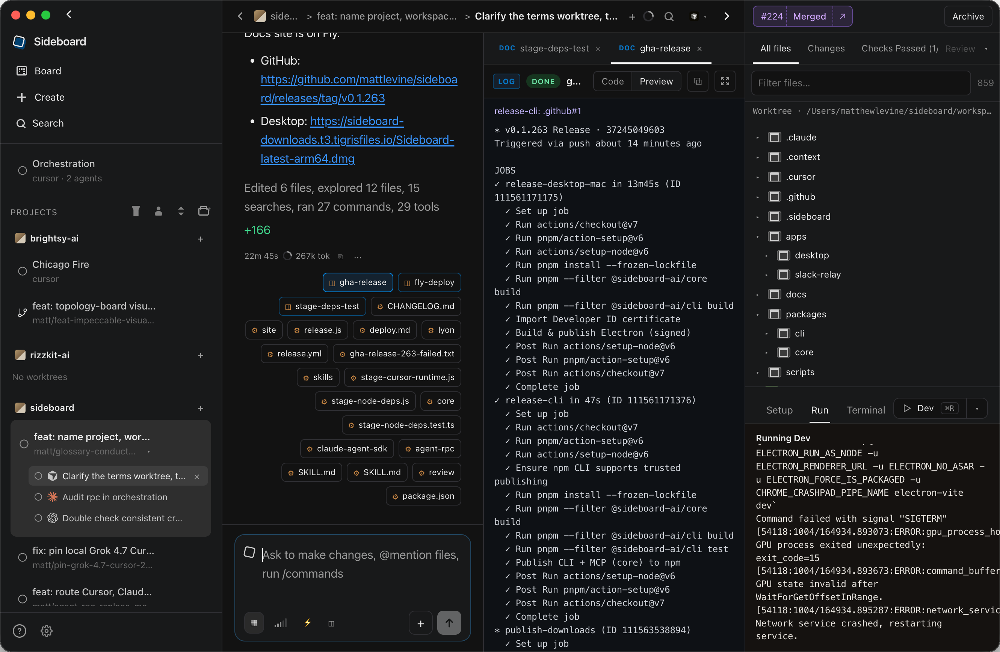

# Sideboard

**Orchestrate a fleet of coding agents on your Mac.** Isolated git worktrees. A kanban of the whole fleet. An orchestrator that can drive it. Slack, CLI, and MCP so other systems can reach this machine — without a cloud workspace.

One agent per git worktree is a crowded pattern in 2026 — Conductor, Orca, Cursor’s Agents window, Claude Code, and OSS boards (Superset, Emdash, Claude Squad) all spawn that. The remaining job is an **orchestration tier**: an agent that can reason about other threads, a board where you can see that, and remotes so a coworker or another tool can enter the loop — without moving the repo into someone else’s cloud.

Sideboard started as a local port when Conductor moved that tier into a paid cloud, then added the pieces that still belong on this Mac: MCP orchestration, a global kanban, Slack remote, and CLI / MCP so other systems can drive it. Agents are plugs (Claude Code, Codex, OpenCode, Cursor). Compute stays on this machine (corporate VPN, private git, internal APIs). Slack is remote control, not a rented sandbox.

1. **A global board for you** — status, live output, and fan-out across every thread
2. **An MCP for the agents** — list threads, wait on turns, read diffs, orchestrate the fleet, and present artifacts, schemas, and files in the desktop UI
3. **Slack, CLI, and MCP to this Mac** — DM/@mention the orchestrator; register MCP from any harness; script the fleet without the GUI

`attach` / `adopt` remain the door back to the native harness — move in and out of Sideboard as you choose.

Run agents in isolated `thread/*` worktrees from the CLI, desktop, or MCP. The Mac must stay awake for Slack to reach them, and for scheduled jobs to fire — opt in from Settings → Advanced.



**Agents and backends are plugs, not the product.** CLI, MCP, and the desktop board work with Claude Code, Codex, OpenCode, and Cursor alone. Schema UI is **JSON Schema → table/form**, not a CMS shell. The agent can invent a schema for whatever data it needs; wire inline JSON or another datasource later. CLI and MCP also run without the desktop app. Slack is built in ([setup](#slack)).

## Who it's for

Fits if you already run several local CLI agents on a Mac — especially one on a corporate VPN — and want an orchestrator you can see, an agent can drive, and Slack / CLI / MCP can reach. Extra fit when the agent produces structured content or HTML that should sit next to the diff.

Use something else if you want a polished local board and will not use CLI/MCP ([Conductor](https://www.conductor.build/) free), their paid cloud workspaces (agents that keep running after you close the laptop, off-VPN), a full agent IDE ([Orca](https://www.onorca.dev/)), an IDE-native Agents window (Cursor 3), Windows/Linux desktop ([Emdash](https://emdash.sh/), [Superset](https://github.com/superset-sh/superset)), or cloud agents that do not run on this machine.

Peer-by-peer notes: [Compare](docs/COMPARE.md).

## Why it exists

Spawning worktrees is the shared primitive. When Conductor moved fleet orchestration into a **paid cloud**, Sideboard started as a local port, then kept the rest on this Mac: an orchestrator, a kanban, Slack, and CLI / MCP so other systems can drive it — on the VPN you already sit on:

| Job | Typical tools | Sideboard |
|-----|---------------|-----------|
| Run N agents in isolated worktrees | Yes | Yes |
| Orchestrate the fleet (agent-visible) | Human board, or a cloud API | MCP + Global board, on this Mac |
| Stay on the corporate VPN | Cloud sandboxes leave it | Agents run as you, on this laptop’s network |
| Coworker in the loop | Product cloud / shared sandbox | Slack: review ping; reply comes back as info |
| Keep going when you step away | Cloud sandbox keeps running | Slack to this Mac — the machine must stay awake (opt-in caffeinate) |
| Run work on a schedule | Cloud cron / always-on sandbox | Local jobs on this Mac; opt-in caffeinate so due jobs can fire |
| See the whole fleet as one board | App-locked or thin | First-class global board |
| Drop into the native CLI mid-session | Weak or one-way | `attach` keeps the same session |
| Recurring process guides | Locked in the product, or chat memory | Committed `.claude/skills` — Claude Code and `attach` load them |
| Bring existing worktrees / Conductor workspaces in | Stuck or start over | `adopt` + Conductor import |
| Review HTML / docs the agent built | Copy out, or locked chat UI | `present_artifact` → side column |
| Collect / edit structured data the agent needs | Spreadsheet, separate CMS, or markdown forever | `present_schema` → form/table from a schema the agent can create |
| Files for that data + the git worktree | Two other windows | File manager tabs + far-right repo Files / Changes / CI |

Agents write code **and** invent data shapes (content, configs, feedback, ops rows). Sideboard is where those meet — **code in the worktree, data in schema UI** — without a CMS product.

A concrete loop: pull or edit page content and media in schema + files tabs, then have the agent write it into a **static site** in the same worktree (Astro, Next export, Eleventy, plain HTML) — review the data and the generated pages before you land.

Mechanical control (list, send, diff, land) stays on the CLI — zero tokens. Use MCP when an agent needs *judgment* across threads or needs to open a pane. CLI `land` and `purge` stay human-only. Orchestrators may tell a worktree agent to merge (`ask_git`) only when the user explicitly asked.

Also true, and useful on the way:

- **Agent-agnostic** — Claude Code, Codex, OpenCode, Cursor (user-installed `@cursor/sdk`)
- **Schema-agnostic / CMS-optional** — render any JSON Schema + `schemaUi`. CMS is a use case, not the category
- **Surface-agnostic** — CLI (`sideboard` / `side`), Electron desktop, MCP, or native interactive via `attach`
- **Origin-agnostic** — create from branch/PR/ticket, adopt any worktree, import Conductor workspaces with chat history
- **Local-first / Slack-remote** — agents stay on this Mac (VPN, private git, internal APIs); Slack is how you and a coworker reach them ([setup](#slack))
- **Portable process skills** — recurring guides are Claude Code project skills (`.claude/skills/<name>/SKILL.md`). Sideboard `/name`, Claude Code, and `attach` all load that path ([Process skills](#process-skills))

Docs: [www.sideboard.cloud/docs](https://www.sideboard.cloud/docs/) · [Settings](#settings) · [Slack](#slack) · [Scheduled orchestration](#scheduled-orchestration)

Marketing site: [www.sideboard.cloud](https://www.sideboard.cloud) · [docs](https://www.sideboard.cloud/docs/) (same Fly app as the relay; `relay.sideboard.cloud` is the phone remote and legacy Slack). Desktop downloads: [latest Mac build](https://sideboard-downloads.t3.tigrisfiles.io/Sideboard-latest-arm64.dmg). CLI stays on npm (`@sideboard-ai/cli`).

## Install

### CLI (npm)

```bash
npm i -g @sideboard-ai/cli
sideboard detect
```

### Desktop

Download the latest **Apple Silicon** Mac build:

https://sideboard-downloads.t3.tigrisfiles.io/Sideboard-latest-arm64.dmg

The app auto-updates via `electron-updater` (checks on launch and every 4 hours; shows an in-app + OS notification when a new version is available, then **Restart to update** when the download finishes — never restarts mid-session silently). New builds also land on that host as `latest-mac.yml` (existing installs still check GitHub until a later updater cutover).

#### Releasing

```bash
# One-time: copy Brightsy (or your) Developer ID + npm token into apps/desktop/.env
cp apps/desktop/.env.example apps/desktop/.env

# From repo root — bump versions, publish npm + Mac desktop, tag
pnpm release                 # patch → @sideboard-ai/cli + @sideboard-ai/core + desktop
pnpm release minor
pnpm release patch npm       # CLI + MCP only (core ships `sideboard-mcp`)
pnpm release patch mac       # desktop GitHub Release only
pnpm release patch all never # dry-run / local artifacts
```

Pushing a `v*` tag to origin is what runs [`.github/workflows/release.yml`](.github/workflows/release.yml) (npm OIDC + Mac Electron). There is no **Run workflow** button. Worktree / chat agents: bump, commit the Release, merge, then retarget `vX.Y.Z` onto that commit and push the tag — do **not** pack Electron in the turn. Watch **Actions → Release**; use `/long-running` with `scripts/watch-gha-run.cjs` (do not `gh run watch`). Local `pnpm release patch mac` is for a human at a real terminal.

After `npm i -g @sideboard-ai/cli`, MCP is `sideboard mcp` (or `npx sideboard-mcp`).

### Agent CLIs

Sideboard shells out to each agent’s CLI. Install the ones you want on your `PATH`, then authenticate. `sideboard detect` reports what’s available.

#### Claude Code

```bash
npm install -g @anthropic-ai/claude-code
claude          # complete login on first run
```

Docs: [code.claude.com/docs/en/install](https://code.claude.com/docs/en/install)

#### Codex

```bash
npm install -g @openai/codex
codex           # complete login / auth on first run
```

Docs: [github.com/openai/codex](https://github.com/openai/codex)

#### OpenCode

```bash
# Recommended (macOS / Linux)
curl -fsSL https://opencode.ai/install | bash

# Or via npm (package name is opencode-ai, not opencode)
npm install -g opencode-ai@latest
opencode auth login
```

Docs: [opencode.ai/docs](https://opencode.ai/docs)

#### Cursor

Local Cursor agents via the official SDK (same approach Conductor uses — not a CLI spawn). Sideboard does **not** ship `@cursor/sdk`; install or update it from **Settings → Agents → Cursor → Install** (or `npm i -g @cursor/sdk`).

Then set the key in the desktop app under **Settings → Agents → Cursor** (also appears under **Settings → Environment** as `CURSOR_API_KEY`), or in your shell:

```bash
export CURSOR_API_KEY="cursor_..."   # https://cursor.com/dashboard/integrations
sideboard detect                     # cursor should show authenticated
```

Shell env wins if both are set. Docs: [cursor.com/docs/sdk/typescript](https://cursor.com/docs/sdk/typescript)

Verify everything Sideboard can see:

```bash
sideboard detect
```

## Quick start

The loop that matches why Sideboard exists: board → send → inspect → attach when you want the native CLI → land when ready.

```bash
sideboard detect
sideboard new --from branch:main --agent claude
sideboard ls
sideboard send <thread> "add a README note"
sideboard diff <thread>
sideboard attach <thread>        # drop into the native CLI, same session
sideboard land <thread>          # interactive y/N; no --yes in v1
sideboard adopt --from-conductor # import Conductor workspaces + history
```

Aliases: `side` → `sideboard`.

For the global board, live orchestration, and the code + data desktop layout, run the app.

## Desktop — union of agent code and data

A worktree chat is **repo + worktree + CMS** in one view:

| Zone | Layer | What it is |
|------|-------|------------|
| **Far right** | Repo | Connected git worktree — Files / Changes / CI / Review, Setup / Run / Terminal |
| **Chat** | Worktree agent | The thread driving that worktree. Nested Task / Agent / `spawn_agent` work shows as a card under the parent tool. |
| **Structure column** (tabs) | CMS / data | Artifacts, schema → form/table, file manager — content and files the agent needs you to see or edit |

Agents open structure tabs via MCP (or you reopen them from message chips). Tabs stick per chat until you close them.

Token counts always show on message chips, the thread Σ total, and worktree hover spend. **Settings → Advanced → Show cost (when available)** (off by default) also shows provider-reported USD when the agent CLI reports it (Claude, Cursor, OpenCode, Brightsy). Codex streams tokens only — no USD. Claude chats also show remaining Claude Code plan usage (5-hour, weekly, and per-model windows when the login has them) next to the context ring. Hover the meter for used/remaining bars, reset time, and extra usage. Global / orchestration chats show the same account-level meter.

### Schema → form (not “a CMS product”)

`present_schema` takes **JSON Schema + optional `schemaUi`** and renders a filterable table and/or form. The agent can **create the schema** for whatever it needs — articles, feedback, config, checklists, research rows — then hand you a UI to fill or correct it. That might back a CMS, feed a **static website** build in the worktree, or be a one-off shape for the turn. A markdown table in chat is enough to *read* the data; use this tool when you need to filter, edit, or persist rows (including after a markdown table, if you ask for an editable one).

Same chrome for every backend:

- Typed fields from the schema; TipTap rich text + markdown via `schemaUi`
- Relationships (has-one / has-many) with in-pane navigation
- Draft / publish only when the resource declares content states — otherwise save-only
- Media fields jump to a Files tab in **select mode**, then return to the form

| Provider | When |
|----------|------|
| `inline` | Agent embeds `resource` / `records` in the tool call — any use, no extra account |
| `brightsy` | Optional — logged-in Brightsy team + `resource_id` |

### Artifacts & file manager

- **`present_artifact`** — HTML / SVG / markdown / React, or **`type=log`** (append-only stream; same `artifact_id`, new lines only)
- **`present_files`** — browse / upload / pick (`memory` demo, or optional Brightsy storage). Drag from Finder or from Sideboard’s worktree file list. Multiple Files tabs can sit beside multiple schema tabs.

New datasources implement list/get/save (and optional publish). They do not fork the column UI.

## MCP — agents that can see the fleet

Install the CLI (ships the stdio server), then register it with your MCP client:

```bash
npm i -g @sideboard-ai/cli
sideboard mcp          # same as: npx sideboard-mcp
```

Sideboard desktop **auto-injects** this MCP into Claude / Cursor / Codex / OpenCode turns (orchestration and worktree). The packaged Mac app also merges a `sideboard` entry into `~/.cursor/mcp.json` (and `~/.claude.json` if it already exists) so Cursor IDE / Claude Code see the same fleet and store as Sideboard.app (`SIDEBOARD_APP_DATA` → `~/Library/Application Support/sideboard`). Use the steps below when you want to register MCP yourself — Claude Code in a project, Cursor IDE Agent, Codex CLI, etc.

Pin `SIDEBOARD_APP_DATA` if a `sideboard` binary on PATH should still hit this Mac’s Sideboard store.

### Connect Claude Code

```bash
# All projects (user scope)
claude mcp add --scope user sideboard -- sideboard mcp

# Or one project only (omit --scope, or use --scope project)
claude mcp add sideboard -- sideboard mcp
```

Confirm with `/mcp` inside a Claude session, or `claude mcp list`.

### Connect Cursor

Add a project or global MCP entry (Cursor → Settings → MCP, or `.cursor/mcp.json`):

```json
{
  "mcpServers": {
    "sideboard": {
      "command": "sideboard",
      "args": ["mcp"],
      "env": {
        "SIDEBOARD_APP_DATA": "/Users/you/Library/Application Support/sideboard"
      }
    }
  }
}
```

Prefer `npx -y sideboard-mcp` for `command` / `args` if `sideboard` is not on Cursor’s PATH. Packaged Sideboard.app writes the absolute `node` + extraResources path here on launch (merge, does not clobber other servers).

### Connect Codex

Add to `~/.codex/config.toml` (or pass equivalent `-c` overrides):

```toml
[mcp_servers.sideboard]
command = "sideboard"
args = ["mcp"]

[mcp_servers.sideboard.env]
SIDEBOARD_APP_DATA = "/Users/you/Library/Application Support/sideboard"
```

Sideboard does not rewrite `~/.codex/config.toml`; add the block above (or equivalent `-c` overrides) so Codex CLI shares the packaged store.

### Connect OpenCode

Add to `~/.config/opencode/opencode.jsonc` (or a project `opencode.jsonc`) under `mcp`, or merge via `OPENCODE_CONFIG_CONTENT`:

```json
{
  "mcp": {
    "sideboard": {
      "type": "local",
      "command": ["sideboard", "mcp"],
      "enabled": true
    }
  }
}
```

### What agents get

Once connected, agents get tools to:

- **Discover** — `list_board` (worktree Kanban: New → Draft → Review → Merged; `create_workspace` adds a workspace), `list_projects` (path + GitHub slug), `list_branches` / `list_prs` (`queue=review` for the unclaimed `eng-review` inbox — PRs for assigned ticket work; a team like `engineering-team` is not a claim; also `state`, `label`, `reviewer` = `me` / `unassigned` / login) / `list_issues` (Linear, AbleTime MCP, or GitHub; `updatedSince` for “any updates since yesterday?”), `list_chats`
- **Linear tickets** — `linear_list_teams`, `linear_search_issues` / `list_issues` (`query`, `assignee` = `me` / `unassigned` / `all` / user, `updatedSince` for inbox updates + comments, `limit` default 40 max 250; raise `limit` or tighten `query` when `truncated`), `linear_get_issue` (default SmartCrusher-style crush on redundant comments / huge pasted bodies; small unique tickets pass through; `include=full` for the uncompressed vendor payload), `linear_download_attachment` (Account auth → `.context/attachments/`; do not dump bytes into the tool result), `linear_create_issue`, `linear_update_issue` (title, state, assignee, priority, cycle, labels, project, parent, relations), `linear_comment` (Settings → Issues OAuth; reconnect if you connected before write access). Linear / AbleTime mutation tools register only when that account is connected.
- **AbleTime tickets** — `abletime_orientation`, `abletime_list_projects`, `abletime_list_tasks` / `abletime_search_tasks` (`updatedSince` for inbox updates when the hosted payload includes timestamps), `abletime_get_task`, `abletime_download_attachment` (Account auth → `.context/attachments/`), `abletime_update_task` (title, state, labels, project, parent, relations), `abletime_create_task`, `abletime_ensure_task` (Settings → Issues personal access token → hosted MCP). When AbleTime is the preferred issue source, starting work without a ticket auto-creates one to track against.
- **Workspaces** — `add_project` / `remove_project`
- **Worktree chats** — `create_workspace` → `send_to_chat` → `wait_for_turn` / `get_turn_result` (from a Sideboard orchestration chat, omit `parentChatId` — MCP binds the child to that chat; do not invent uuids). A ticket, PR, or named branch may have only one live worktree — `create_workspace` returns that chat (`alreadyStarted`) instead of a second checkout; default-branch create still opens a new isolated worktree. `wait_for_turn` returns within ~45s with `stillRunning`, `taskState` (submitted / working / input-required / completed / failed / canceled), and live `progress` while the child is still working — call it again; do not assume a hang. `fork_workspace` / `fork_chat` (optional agent; Auto model unless pinned via `list_models`; `fork_chat` also forks Global orchestration chats); `stop_chat` force-stops (kills in-flight turn and clears the prompt queue); `send_to_chat` steers (Settings → Follow-up, default interrupt now) and accepts optional `force_stop` to clear the inbox first; `archive_chat`, `restore_chat`
- **Present structure (desktop)** — `present_artifact` (HTML/SVG/MD), `present_schema` (JSON Schema → table/form; agent can invent the schema), `present_files` (file manager); tabs beside chat, git repo stays on the far right
- **Ask the user** — `ask_user` (composer multiple-choice when work is blocked on a concrete choice — not greetings or “what next?” menus). Agents explain options in chat first; Sideboard shows the picker and mirrors questions in the transcript. On a worktree child, `ask_user` also wakes the parent Global chat (`notify_orchestrator`, `input-required`) so the coordinator does not have to poll. Worktree agents can call `notify_orchestrator` themselves when blocked without a picker.
- **Schedules** — `list_schedules` / `create_schedule` / `update_schedule` / `delete_schedule` / `run_schedule` (orchestration and worktree). `threadId=self` continues this chat; omit `threadId` to start a new Global chat when due. Jobs fire only while Sideboard.app is running. Creating or enabling a future job turns on **Settings → Advanced → Caffeinate while schedules are enabled**. Orchestration chats can also `set_caffeinate`.
- **Setup / run** — `run_setup` (also runs automatically on new worktrees), `list_run_scripts`, `run_dev_script`, `stop_dev_script`, `get_run_log`
- **Inspect / review / PRs** — `get_diff`; `get_pr_checks` (snapshot); `request_review` (opens a Review chat tab on a worktree thread). The review stays in chat so you can read it and type next steps before the PR or ticket author is notified — no immediate Post/Keep picker. `ask_git` (commit & push, draft PR, ready for review, resolve conflicts, merge — same prompts as the desktop git buttons). If a goal is given (Greptile 5/5, CI green), the worktree agent watch-fix-pushes until it lands. Merge only when the user explicitly asked.
- **Keep the Mac awake** — `set_caffeinate` from an orchestration chat (released when that chat closes). Independent Advanced toggles: while agents are running, while the phone remote is connected, and while schedules are enabled.

Ready-for-review land (`confirm_land`) and `purge_chat` stay human-only. Coordinators commit, push, and open PRs by asking the worktree agent. They merge only when the user explicitly asked.

## Settings

Desktop Settings opens on **Agents**. Connections are owned by Sideboard, not per-agent MCP.

| Panel | What |
|-------|------|
| **Agents** | Default agent, model, and effort; default orchestrator agent, model, and effort; **Account context** (roles, tickets, review queues as freeform text); then harness setup (Claude, Codex, OpenCode, Cursor, Brightsy) |
| **Projects** | Per-repo context that adds to account context. Agents can update either after you confirm. |
| **Git** | How this Mac and worktree agents authenticate git (`gh`, SSH, or a PAT) |
| **Issues** | Preferred tracker plus Linear and AbleTime |
| **Remote** | Slack — remote-control this Mac |
| **Connectors** | Optional project services: Vercel, Supabase, PostHog, Sentry |
| **Environment** | Extra env vars injected into agent runs |
| **Schedules** | Local jobs that wake an orchestration chat |
| **Advanced** | Cowboy mode, caffeinate, show cost, on usage/session limit (keep going, confirm, switch agent, or wait for reset), Brightsy MCP inject |
| **History** | Archived chats |

Ask the orchestrator **find me some work** to list matching tickets (`list_issues`) and review PRs (`list_prs queue=review`) from that profile. **Find me work and start it** lists, then creates the worktrees. Same split for reviews. The orchestrator stays contextually aware of that profile in every chat.

## Git

**Settings → Git.** Pick how Sideboard and worktree agents authenticate GitHub on this Mac:

- **Auto** (recommended) — HTTPS in the agent process using this Mac’s `gh` login
- **gh CLI auth** — rewrite `git@github.com` remotes to HTTPS; git/gh use a Sideboard credential file
- **SSH** — keep SSH remotes (batch-mode; fails instead of prompting Keychain)
- **Personal access token** — store a PAT on this Mac (not in the agent environment)

If git/gh fail with auth errors, run `gh auth login` on this Mac or set a PAT here. Agents should not wait for a Keychain dialog.

## Linear

**Settings → Issues → Linear → Connect via browser.** Sideboard stores the OAuth token on this Mac and uses it for Create-from / Link issue and MCP ticket tools (`linear_create_issue`, `linear_update_issue`, `linear_comment`). A personal API key still works if you paste one.

OAuth requests `read,write`. Linear’s OAuth app page has no scopes checklist — Sideboard sets them in `LINEAR_OAUTH_SCOPES`. If you connected when Sideboard was read-only, **Disconnect and Connect via browser** so Linear re-consents.

Desktop Connect uses Chromium networking so corporate VPNs/proxies that break Node `fetch` (`Error invoking remote method 'startLinearOAuth': fetch failed`) still reach `api.linear.app`. CLI `sideboard linear login` still uses Node fetch — set `HTTPS_PROXY` or connect off-VPN.

## AbleTime

**Settings → Issues → AbleTime → Connect via browser.** Sideboard uses AbleTime’s MCP OAuth (PKCE + Client ID Metadata Document at `https://www.sideboard.cloud/oauth/abletime-client.json`). An admin must enable **Agent access (MCP)**. You can still paste a personal access token (`apt_…`) or an organization API key (`atk_…`). Hosted MCP accepts `apt_…` only; browser OAuth tokens and org keys use the public REST API.

AbleTime requires an HTTPS redirect, so the browser returns to `https://www.sideboard.cloud/oauth/abletime/callback` (same host as the CIMD). That page opens the desktop listener at `http://127.0.0.1:19849/callback`. Override the client metadata URL with `SIDEBOARD_ABLETIME_OAUTH_CLIENT_ID` (the document’s `client_id` must match that URL exactly).

Set **Issue source** to AbleTime. Create-from / Home list AbleTime tasks. Starting a thread from the default branch (no ticket) auto-creates an AbleTime task and attaches it. Orchestration tools: `abletime_orientation`, `abletime_ensure_task`, `abletime_create_task`, and the list/search/get variants.

```bash
sideboard linear login
sideboard linear disconnect
```

Callback URL for the Sideboard Linear OAuth app: `http://127.0.0.1:19848/callback`. Override the client with `SIDEBOARD_LINEAR_CLIENT_ID` (secret optional — the desktop uses PKCE). You will not see that baked app under *your* Linear **API → OAuth applications** — it lives on Sideboard’s Linear workspace. Authorized copies show under workspace **Settings → Applications** after you connect.

## Phone

The Sideboard phone app is the remote surface for the **same local orchestrator**. Pair it from **Settings → Remote**. Messages go to a Global chat on this Mac. Agents, worktrees, and repos stay here.

```
┌────────────────┐     hosted relay      ┌──────────────────┐
│ Phone app      │ ─────────────────────► │ Sideboard Mac    │
│ composer       │     (WSS /remote)      │                  │
└────────────────┘ ◄──── replies ─────────└────────┬─────────┘
                                                   │
                                                   ▼
                                          Global orchestrator → worktrees
```

**What stays on this Mac.** Agents, worktrees, repos, and secrets. **What leaves:** message text, via `relay.sideboard.cloud`. The relay does not host worktrees.

Keep the desktop app running. The phone cannot reach a sleeping Mac. Enable **Settings → Advanced → Caffeinate while the phone remote is connected**, or `set_caffeinate` from an orchestration chat when you step away.

### Pair

1. Open Sideboard on the Mac. **Settings → Remote** should show Relay connected. Name this Mac if you want.
2. **Show pairing code.**
3. In the phone app, enter that code. The next messages open a Global chat titled Phone.

A phone can pair with more than one Mac. Name each one in **Settings → Remote** (Work, Personal). The phone lists those desktops and you choose which one to open. Pairing again adds another Mac. Messages go only to the desktop you picked.

Send `stop` to cancel the in-progress turn. When the coordinator calls `ask_user`, the phone shows the options.

Override the relay with `SIDEBOARD_REMOTE_RELAY_URL` (default `wss://relay.sideboard.cloud/remote`).

The phone project is `apps/mobile`. The Run menu’s **Mobile** entry starts Metro and opens the iOS Simulator when that app is installed. If Simulator.app is missing, Metro stays up and Expo Go opens on a simulator that is already booted. Pair from **Settings → Remote**.

More detail: [docs/remote-integrations.md](docs/remote-integrations.md).

## Connectors

**Settings → Connectors.** Optional tokens for project services. Agents use official CLIs (or the PostHog HTTP API) with env injected into the worktree — not vendor MCPs.

| Service | Env | Agent path |
|---------|-----|------------|
| Vercel | `VERCEL_TOKEN` | `vercel` CLI |
| Supabase | `SUPABASE_ACCESS_TOKEN` | `supabase` CLI |
| PostHog | `POSTHOG_PERSONAL_API_KEY`, optional `POSTHOG_HOST` | HTTP API (no first-class CLI) |
| Sentry | `SENTRY_AUTH_TOKEN`, optional `SENTRY_URL` | `sentry-cli` |

Tokens stay in the Mac vault. Disconnect from the same panel. If `vercel`, `supabase`, or `sentry-cli` is missing, **Install CLI** runs `npm i -g` (opens Terminal if npm needs sudo). Sideboard does not auto-install on Connect. Agents write CLI/HTTP dumps to `.context/cli/` (local scratch; not composer drops in `.context/attachments/`) and read a slice — never raw `--json` / `--expand` into the tool result. The phone remote is **Settings → Remote**, not here.

## Scheduled orchestration

Local jobs that send a prompt to an existing chat (Global or worktree), or start a new Global chat. Sideboard.app must be running on this Mac; a sleeping machine skips until wake. Creating or enabling a future job turns on **Settings → Advanced → Caffeinate while schedules are enabled** (you can turn it off anytime). Orchestration chats can also call `set_caffeinate`.

**Settings → Schedules**, MCP (`list_schedules` / `create_schedule` / `run_schedule` — orchestration and worktree agents), or:

```bash
sideboard schedule ls
sideboard schedule add --prompt "Triage open PRs" --every 1h --thread <id>
sideboard schedule add --prompt "Morning standup" --cron "0 9 * * *" --tz America/Los_Angeles
sideboard schedule add --prompt "One-shot reminder" --at 2026-08-21T18:00:00-07:00
sideboard schedule run <id>
```

Omit `--thread` to open a new orchestration chat when the job fires (recurring jobs will open a new chat each run). Pass `--thread self` from an agent turn (or `threadId=self` in MCP) to continue that chat. If the target chat is missing or archived when the job fires, Sideboard starts a new Global chat (recurring jobs then continue that chat).

## Also: Brightsy

Optional hosted chat and one schema/files backend. Skip this if you use Claude, Codex, OpenCode, or Cursor. Remote control of this Mac is **Slack**, not Brightsy.

```bash
npm install -g @brightsy/cli
brightsy login
```

Then Settings → Agents → Brightsy to connect a team. That unlocks hosted chat in the agent picker (no local file edits) and `datasource=brightsy` for `present_schema` / `present_files`. Inline schema and memory files work with no Brightsy account.

`sideboard brightsy teams` / `connect-team` wrap the same team list. Worktree agents get Brightsy MCP only when you ask, or when Settings → Advanced → Inject Brightsy MCP is on.

## Monorepo

```
packages/core     # orchestrator, agents, git, MCP, store
packages/cli      # commander CLI (bins: sideboard, side)
apps/desktop      # Electron (electron-vite + React) — global board UI
```

```bash
pnpm install
pnpm --filter @sideboard-ai/core build
pnpm --filter @sideboard-ai/cli build
pnpm --filter @sideboard-ai/desktop dev
```

## Worktrees & repo config

Worktrees live **outside** the repo (Conductor-style):

```
~/sideboard/workspaces/<repo-slug>/<soccer-team>/
```

New workspaces pick an unused famous soccer team (e.g. `liverpool`, `ajax`) for the worktree directory and a matching placeholder branch — same idea as Conductor’s city nicknames. On the first agent turn, Sideboard asks the agent to rename the branch to match the task; the sidebar then shows the PR title (if any) or that branch name. Create-from-ticket with an empty message (or `sideboard new --from ticket:…` without a prompt) starts that first turn as **Resolve this issue.** Orchestration children still wait for `send_to_chat`.

**Cowboy mode** skips the extra worktree: the chat runs in the registered project folder, which must already be on the default branch. Enable **Settings → Advanced → Cowboy mode** (off by default), then pick Cowboy from New chat → ⋯. CLI `--cowboy` and MCP `create_workspace cowboy=true` also require that setting. Land is commit+push to that branch (no PR). Archiving the chat does not delete the project folder.

Override per repo in `.sideboard/settings.toml`:

```toml
[worktrees]
# root = "~/sideboard/workspaces/my-repo"

[scripts]
setup = "pnpm install"

[scripts.run.dev]
command = "PORT=${SIDEBOARD_PORT:-${CONDUCTOR_PORT:-3000}} pnpm --filter web dev"
default = true

[scripts.run.mobile]
command = "pnpm --filter mobile start -- --port ${SIDEBOARD_PORT}"
```

Each `[scripts.run.*]` script gets its own port range. Starting or restarting one does not take another’s ports, so desktop and mobile (or any pair) can stay up together. The Run menu lists every script; ⌘R only toggles the default.

For Electron / electron-vite apps, add `preview = "window"` on that run script. Sideboard still allocates `SIDEBOARD_PORT` for the Vite renderer, but agents are told the **native window** is the app — `http://localhost:<port>` is HMR only (a browser tab will not have preload/IPC). If `preview` is omitted, Sideboard infers `window` from `electron` / `electron-vite` in the command or the filtered package.

Sideboard prefers `.sideboard/settings.toml` and falls back to `.conductor/settings.toml` when present (so existing Conductor-configured repos keep working). Dev scripts get both `SIDEBOARD_PORT` and `CONDUCTOR_PORT`.

New worktrees run setup automatically (create / fork / stack layer) in the background — it does not block the chat. If `[scripts] setup` is missing, Sideboard uses `.cursor/worktrees.json` `setup-worktree`, then a conventional `script/setup`, `bin/setup`, or `scripts/setup(.sh)` when one of those files exists.

### Review guidelines

If the repo already has `.claude/skills/review/SKILL.md`, Review and **Customize guidelines…** use that file. Otherwise Sideboard copies `.sideboard/review.md` into the worktree’s `.context/review.md` (or seeds that file from the stock template). It does not create a review skill. Workspace-local chat scratch (plans, drops) lives under `.context/attachments/` — same idea as Conductor’s `.context` vs committed `.sideboard/` / `.claude/` config.

### Process skills

When the same shape of work will happen again, write a Claude Code project skill at `.claude/skills/<name>/SKILL.md` and commit it. Sideboard’s composer `/name` expander, Claude Code, and `attach` all load that path — so the guide works outside Sideboard. Do not put new skills in `.sideboard/skills` (Sideboard still scans it; other agents do not). Point Codex/OpenCode at the file from `AGENTS.md`. Optional: symlink `.cursor/skills/<name>` to the Claude skill.

- **One-offs** should not create a skill. The first run is still a loop; corrections become sentences in the guide.
- **Same miss twice** → edit the skill (or `.claude/skills/review/SKILL.md` when that review skill exists, else `.context/review.md`) and rerun. Do not patch three threads and leave the process unchanged.
- After merge to the default branch, **new worktrees inherit** the file. Existing siblings need an update from that branch.

This repo’s method skill is [`.claude/skills/graph-engineering/SKILL.md`](.claude/skills/graph-engineering/SKILL.md) (`/graph-engineering`): judge first, state on disk, grow the rulebook, blind review, fix the process not the instances. A Cursor symlink lives at `.cursor/skills/graph-engineering`. Type `/graph-engineering` in the Sideboard composer to attach it.

`/long-running` is a **Sideboard product skill** — every worktree agent gets the detach-and-wait playbook (and the helper ships with the app). A committed `.claude/skills/long-running` in a repo still wins if you want to customize it.

Older threads that already point at a repo-local path keep working; new threads always use the home-dir (or configured) root.

## Safety (v1)

- Landing on the default branch is blocked, except **cowboy** chats (project folder on `main` / default; land is commit+push)
- Dirty worktrees require an explicit land confirm (auto-commit then push/PR)
- Fork PRs are not landed in v1
- No `--yes` on `land`

## License

Apache-2.0 — see [LICENSE](LICENSE). Contributions welcome under [CONTRIBUTING.md](CONTRIBUTING.md).
